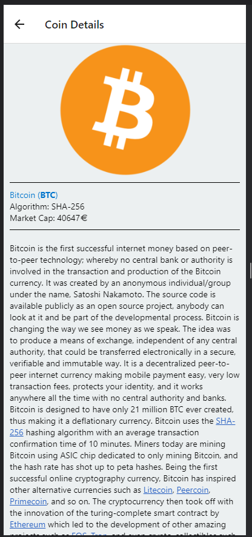

BOI : Markets/Coin Details

To Run the project:
1. Check out the project
2. Go to the project directory
3. Run : npm install 
4. Start the application: npm start
5. Additionally we need the expo client to view the application live
   a. In your Mobile phone install the Expo.io app and create your individual login
   b. In step 4, you should see the QR Code. Just scan the QR Code
   c. Alternatively, you can download the Android/iOS simulators (out of scope for now)

Code has been implemented in form of components:
App ---------> CoinList  ----- CoinListItem ------> CoinItemDetail
                         ----- CoinListItem ------> CoinItemDetail
                         ----- CoinListItem ------> CoinItemDetail
                         ----- CoinListItem ------> CoinItemDetail

Spoilers/ToDo:
1. The initial list is limited to 10 records, without any paginatio
2. List preloaders could be consolidated to a single preloader
3. Move the duplicated code used for loading to a custom hook to avoid redundancy
4. Testing/Test cases could be added using jest package

Contact: +353877151916, praveenghatta@gmail.com